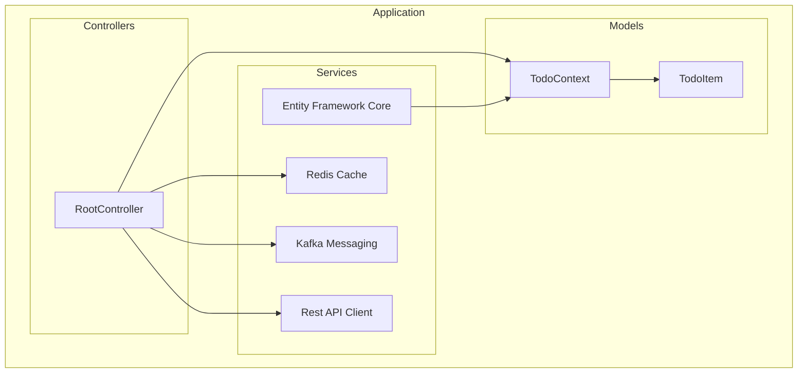

    

    <b>Automatic Architecture Diagrams from Code</b> 
    <a href="https://github.com/swark-io/swark">GitHub</a> • <a href="https://swark.io">Website</a> • <a href="mailto:contact@swark.io">Contact Us</a>

## Usage Instructions

1. **Render the Diagram**: Use the links below to open it in Mermaid Live Editor, or install the [Mermaid Support](https://marketplace.visualstudio.com/items?itemName=bierner.markdown-mermaid) extension.
2. **Recommended Model**: If available for you, use `claude-3.5-sonnet` [language model](vscode://settings/swark.languageModel). It can process more files and generates better diagrams.
3. **Iterate for Best Results**: Language models are non-deterministic. Generate the diagram multiple times and choose the best result.

## Generated Content
**Model**: GPT-4o - [Change Model](vscode://settings/swark.languageModel)  
**Mermaid Live Editor**: [View](https://mermaid.live/view#pako:eNqFUkFuwyAQ_ArinHzAh0qR3UpRFalKcjM5bMzaRsFgwbptFOXvxXYTN7bbckADMwyzCxeeWYk84sIUDuqS7RNhWBi-OfYbq7rWKgNS1vTMAxtbQ85qjc4PbDu21tJADhwaOWOzCSH0yGFvpV0TVtPd1hc_6T_THbp3leHINjl-H0-fDSk6sxcHFX5YdwrFODyMykCpfAxZiWkHWYdHolfIT5B2M9ug91AoU0yMPMVaoaG0hWz1tmb9-jBTRwd6-NhItlw-TXswoxmC_yrpAv9hcAvcS35ceg8xPM-9q9OAfMErdBUoGb7ZRXAqsULBIya4xBwaTYJfg6ipJRAmCsLrVTwi1-CCQ0N2dzbZbe1sU5Q8ykF7vH4ByGbbXA) | [Edit](https://mermaid.live/edit#pako:eNqFUkFuwyAQ_ArinHzAh0qR3UpRFalKcjM5bMzaRsFgwbptFOXvxXYTN7bbckADMwyzCxeeWYk84sIUDuqS7RNhWBi-OfYbq7rWKgNS1vTMAxtbQ85qjc4PbDu21tJADhwaOWOzCSH0yGFvpV0TVtPd1hc_6T_THbp3leHINjl-H0-fDSk6sxcHFX5YdwrFODyMykCpfAxZiWkHWYdHolfIT5B2M9ug91AoU0yMPMVaoaG0hWz1tmb9-jBTRwd6-NhItlw-TXswoxmC_yrpAv9hcAvcS35ceg8xPM-9q9OAfMErdBUoGb7ZRXAqsULBIya4xBwaTYJfg6ipJRAmCsLrVTwi1-CCQ0N2dzbZbe1sU5Q8ykF7vH4ByGbbXA)

